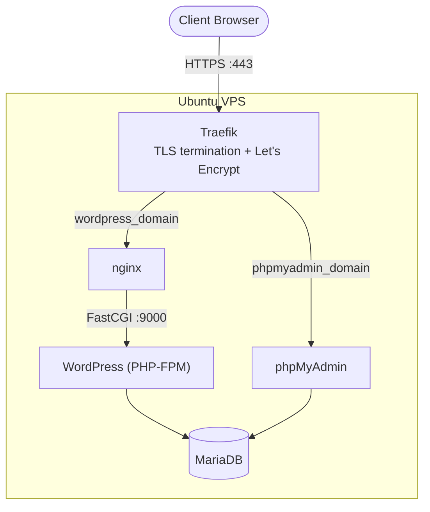

<h1 align="center">cloud-1</h1>

<p align="center"><strong>Infrastructure-as-Code deployment of a Dockerized WordPress stack, built for 42 School's <code>cloud-1</code> project.</strong></p>

<p align="center">
  
  
  
  
  
  
  
</p>

## Table of Contents

- [Overview](#overview)
- [The 42 cloud-1 Project](#the-42-cloud-1-project)
- [Architecture](#architecture)
- [Tech Stack](#tech-stack)
- [Project Structure](#project-structure)
- [Ansible Roles](#ansible-roles)
- [Prerequisites](#prerequisites)
- [Getting Started](#getting-started)
- [Security](#security)
- [Disclaimer](#disclaimer)
- [Author](#author)

## Overview

This repository provisions a single Virtual Private Server into a self-contained, Dockerized WordPress host — entirely through Ansible, with no manual server configuration. One command takes a bare Ubuntu machine to a hardened host running WordPress, MariaDB, phpMyAdmin, and automatic HTTPS.

## The 42 cloud-1 Project

`cloud-1` is a System Administration project from 42 School's post-common core. The goal is to deploy a WordPress website on a VM from a cloud provider using strictly automated, reproducible Infrastructure as Code, covering OS hardening, containerized services, and valid HTTPS.

This implementation:

- Uses **Ansible** for every provisioning step — firewall, SSH hardening, Docker installation, and application deployment.
- Runs **WordPress, MariaDB, nginx, Traefik, and phpMyAdmin** as Docker containers, composed by a single Ansible-rendered `docker-compose.yml`.
- Uses **Traefik** with Let's Encrypt to terminate TLS automatically, and **DuckDNS** for free dynamic DNS and the ACME DNS-01 challenge (since the VM has no owned domain name or guaranteed static IP).

> The official subject, evaluation scale, and grading rubric belong to 42 and are not reproduced in this repository — see [Disclaimer](#disclaimer).

## Architecture



Two Docker networks keep the stack isolated: a `proxy` network containing only Traefik and the containers it fronts (`nginx`, `phpMyAdmin`), and a `backend` network for internal traffic (`nginx` ↔ `WordPress` ↔ `MariaDB`). Traefik is the only container that publishes ports on the host; everything else is reached exclusively through Traefik's Docker-provider routing, driven by container labels.

## Tech Stack

| Layer | Technology |
|---|---|
| Provisioning | Ansible |
| Reverse proxy / TLS | Traefik v3, Let's Encrypt (DNS-01 via DuckDNS) |
| Web server | nginx (Alpine) |
| Application | WordPress (PHP-FPM) |
| Database | MariaDB |
| DB administration | phpMyAdmin |
| Dynamic DNS | DuckDNS |
| Containerization | Docker Engine + Docker Compose |
| Firewall / hardening | ufw, sshd (key-only auth) |
| Secrets management | ansible-vault |

## Project Structure

```
cloud-1/
├── .gitignore
├── CLAUDE.md
├── README.md
└── ansible/
    ├── ansible.cfg
    ├── deploy.yml
    ├── inventory/
    │   ├── hosts.yml          # gitignored — copy from hosts.yml.example
    │   └── hosts.yml.example
    ├── group_vars/
    │   └── all/
    │       ├── vars.yml       # gitignored — copy from vars.yml.example
    │       ├── vars.yml.example
    │       └── vault.yml
    └── roles/
        ├── common/
        ├── security/
        ├── docker/
        ├── duckdns/
        ├── database/
        ├── wordpress/
        ├── phpmyadmin/
        ├── proxy/
        └── app/
```

## Ansible Roles

Roles run in this order from `deploy.yml`:

| # | Role | Responsibility |
|---|---|---|
| 1 | `common` | Verifies the target is Debian/Ubuntu, updates apt cache, upgrades packages |
| 2 | `security` | Hardens sshd (disables password auth and root login) and configures ufw (default-deny inbound, allows 22/80/443) |
| 3 | `docker` | Installs Docker Engine + Compose plugin from Docker's official apt repo, adds `ubuntu` to the `docker` group |
| 4 | `duckdns` | Installs a cron job that refreshes the DuckDNS record every 5 minutes |
| 5 | `database` | Renders a tuned `my.cnf` for MariaDB |
| 6 | `wordpress` | Renders the nginx site config that proxies PHP requests to the WordPress container |
| 7 | `phpmyadmin` | Supplies the phpMyAdmin image tag used by `app` |
| 8 | `proxy` | Supplies the Traefik image tag used by `app` |
| 9 | `app` | Renders `docker-compose.yml` and brings the full stack up |

## Prerequisites

- An Ubuntu (Debian-family) VPS reachable over SSH with key-based authentication
- A control machine with a recent Ansible core (the `docker` role relies on the `deb822_repository` module, added in Ansible core 2.15)
- The `community.general` and `community.docker` Ansible collections
- A free [DuckDNS](https://www.duckdns.org/) account and token, for dynamic DNS and the Let's Encrypt DNS-01 challenge

## Getting Started

```bash
git clone <this-repo-url>
cd cloud-1/ansible

# Install the required collections
ansible-galaxy collection install community.general community.docker
```

Copy the example inventory and vars files, then fill in your own values — both are gitignored so your real infrastructure details never get committed:

```bash
cp inventory/hosts.yml.example inventory/hosts.yml
cp group_vars/all/vars.yml.example group_vars/all/vars.yml
```

Edit `inventory/hosts.yml` with your VPS IP, SSH key, and domains:

```yaml
all:
  hosts:
    cloud1:
      ansible_host: <VPS_PUBLIC_IP>
      ansible_user: ubuntu
      ansible_ssh_private_key_file: ~/.ssh/<your_key>.pem
      ansible_python_interpreter: /usr/bin/python3.12
      wordpress_domain: "<your-subdomain>.duckdns.org"
      phpmyadmin_domain: "<your-subdomain>-pma.duckdns.org"
```

Set `duckdns_domain` and `email` in `group_vars/all/vars.yml`, then create the encrypted secrets file:

```bash
ansible-vault create group_vars/all/vault.yml
```

```yaml
vault_duckdns_token: "<your-duckdns-token>"
vault_mariadb_root_password: "<a-strong-password>"
vault_mariadb_password: "<another-strong-password>"
```

Deploy:

```bash
ansible-playbook deploy.yml --ask-vault-pass
```

Once the play finishes, the site is live at `https://<your-subdomain>.duckdns.org`, with phpMyAdmin at `https://<your-subdomain>-pma.duckdns.org`.

## Security

- ufw default-denies all inbound traffic except SSH (22), HTTP (80), and HTTPS (443)
- sshd disables password authentication and root login — key-based access only
- All secrets (DuckDNS token, MariaDB passwords) live in `group_vars/all/vault.yml`, encrypted at rest with `ansible-vault` (AES256)
- TLS certificates are issued and renewed automatically by Traefik via Let's Encrypt's DNS-01 challenge
- Only Traefik publishes ports on the host; every other service is reachable solely through internal Docker networks
- The Docker socket is mounted **read-only** into the Traefik container

## Disclaimer

This repository is a personal implementation of the `cloud-1` project from 42 School's post-common core curriculum. The official subject, evaluation scale, and grading rubric are the property of 42 and are not included here.

## Author

**Romain Pepi**
42 School student
